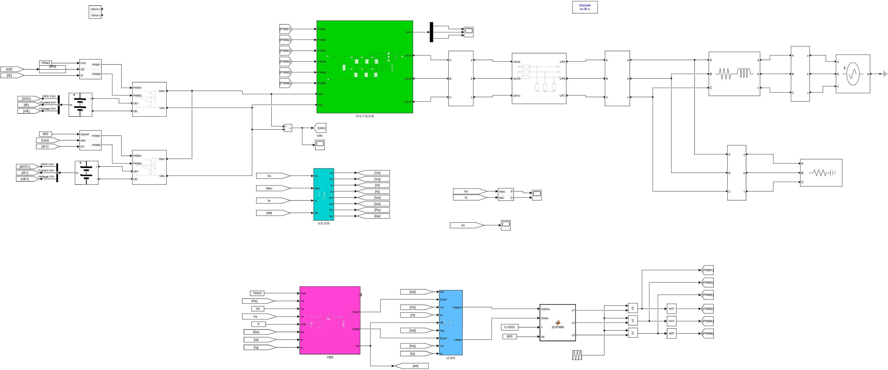
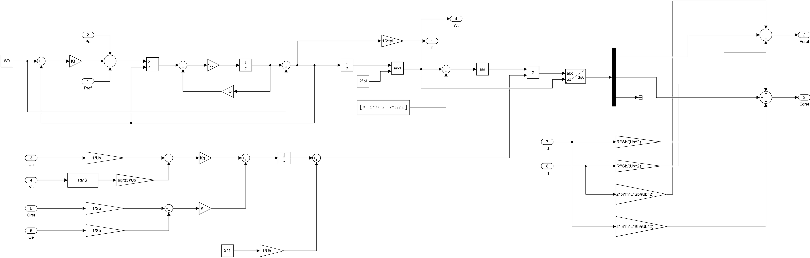
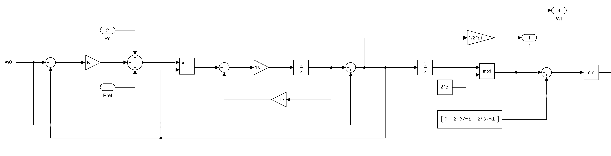
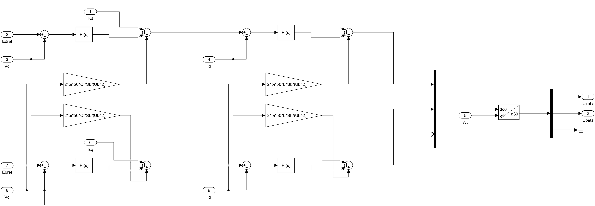
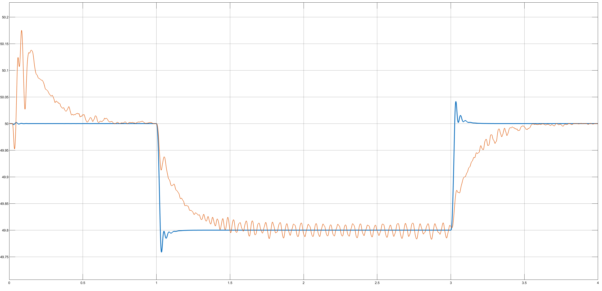
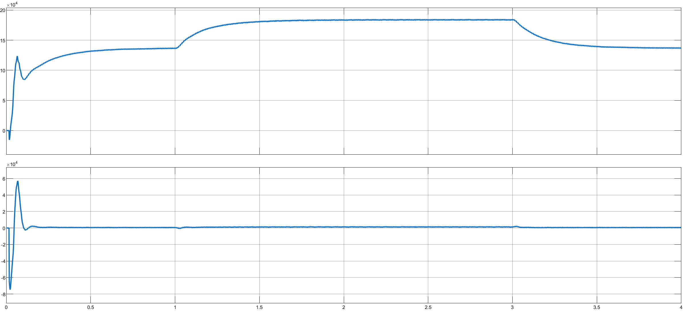
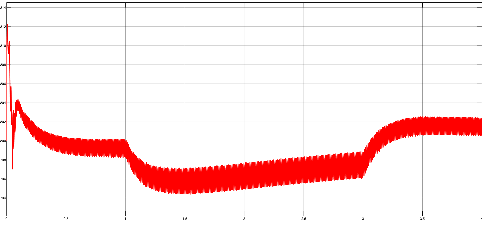
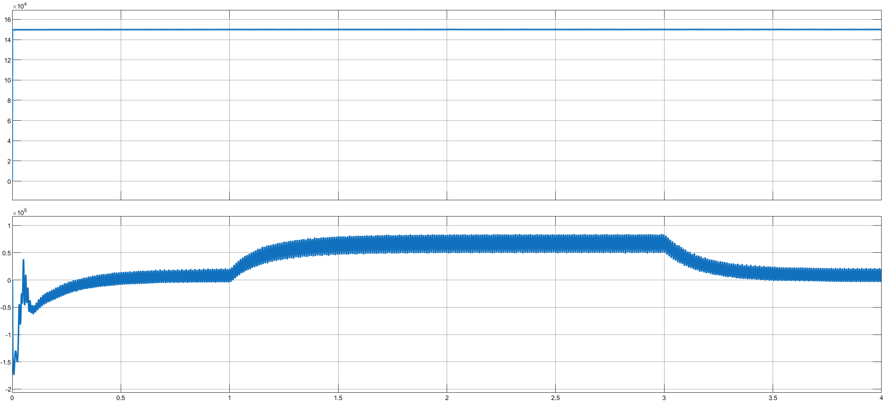

# VSG_2level
# 🔋 基于VSG的三相储能并网变流器仿真（MATLAB/Simulink）

## 📌 项目简介

本项目基于 MATLAB/Simulink 与 Simscape Electrical 工具箱，搭建**三相两电平储能并网变流器**完整仿真模型，采用**虚拟同步发电机（VSG）控制策略**，实现储能系统的构网型并网运行。

与常见研究将直流侧简化为理想电压源不同，本模型构建了**双锂电池组 → Boost DC/DC → 三相VSC → LC滤波 → SVPWM调制**的完整链路，设计了主电池功率调度、辅助电池电压稳定的**双电池协调控制方案**，涵盖并网功率调节、一次调频、孤岛切换等多种运行模式。

---

## 🎯 项目目标

- 构建含双储能电池的三相并网变流器完整仿真模型
- 实现 **VSG 构网型控制策略**（P-f/Q-V 功率外环 + dq 双闭环 PI 内环）
- 基于 Stateflow 实现 **SVPWM 空间矢量调制**，替代传统 SPWM
- 设计**双电池功率-电压协调控制**，贴近实际储能电站架构
- 验证并网运行、频率扰动、负荷突变及孤岛切换等多工况动态响应

---

## 🧠 系统架构

本模型按功率流向和控制层级分为以下模块：

### 1️⃣ 直流侧——双储能电池系统

| 电池 | 容量 | 控制策略 | 功能 |
|:---|:---|:---|:---|
| Battery（主储能） | 500V / 100Ah | 功率环 PI → PWM | 响应调度指令，提供基荷有功 |
| Battery1（辅助储能） | 500V / 50Ah | 电压环 PI + 电流环 PI → PWM | 维持直流母线 800V 稳定，承担动态功率调节 |

- 两组电池均通过 **Boost 升压变换器**（L=1.68mH, C=5.5mF）接入 800V 直流母线
- 主电池负责**功率调度**，辅助电池负责**电压支撑**，控制通道解耦，互不干扰

### 2️⃣ 交流侧——三相两电平 VSC

- 6×IGBT 三相两电平逆变桥
- LC 滤波器（L=1mH, C=35μF 每相）
- 线路阻抗 + 三相可编程电压源模拟电网（380V / 50Hz）
- 三相 RLC 并联负荷 + 断路器，支持并网/孤岛切换

### 3️⃣ 控制系统（分层设计）

```
PCC电压/电流 → 坐标变换(abc→dq) → VSG控制(P-f/Q-V) → 双闭环PI(电压+电流) → SVPWM → 6路PWM
```

| 控制环节 | 核心功能 |
|:---|:---|
| **坐标变换** | abc→dq0 变换 + 正序功率计算（Pe/Qe 提取） |
| **VSG 有功-频率（P-f）** | 转子运动方程，J=3.36，模拟惯量与阻尼，具备一次调频能力 |
| **VSG 无功-电压（Q-V）** | 一次调压（Kq 下垂）+ 二次调压（Ki 积分补偿），消除稳态偏差 |
| **电压外环 PI** | 跟踪 VSG 电压参考，Kp=5, Ki=153.33，含 Cf 电容电流补偿 |
| **电流内环 PI** | dq 轴解耦 + ωL 前馈，Kp=14.2, Ki=0.323，快速电流跟踪 |
| **SVPWM 调制** | Stateflow 实现，直流电压利用率较 SPWM 提升约 15% |

---

## ⚙️ 关键参数

| 参数 | 数值 | 含义 |
|:---|:---|:---|
| Ub | 380 V | 基准线电压 |
| Sb | 150 kVA | 基准容量 |
| Udc | 800 V | 直流母线电压 |
| fn | 50 Hz | 额定频率 |
| J | 3.36 | 虚拟转动惯量 |
| D | 3.24×10⁴/ω₀ | 阻尼系数 |
| Kf | 2.941×10⁶/ω₀ | 频率调节系数 |
| Ts | 1 μs | 仿真步长（离散） |

完整参数详见模型 InitFcn 回调（`File → Model Properties → Callbacks → InitFcn`）。

---

## 📈 仿真工况

### 工况 1：电网频率阶跃
可编程电压源模拟频率突变（∆f = −0.2 Hz），验证 VSG 惯量响应与 P-f 下垂特性——频率偏差 → 有功调节 → 频率支撑

### 工况 2：负荷突变 + 孤岛切换
t=1.0s 突增 50kW 负荷，t=2.0s 断开电网进入孤岛运行，验证并网/孤岛双模式下的功率响应、频率稳定与直流母线电压鲁棒性

监测信号：频率 f、有功 Pe / 无功 Qe、直流母线电压 Udc、电池 SOC/SOC1

---

## 🖼️ 模型截图

## 系统整体拓扑结构


## VSG控制整体架构框图


## P-f控制回路信号流


## 电压电流双闭环子系统


## 频率阶跃响应（工况一）


## 有功/无功功率响应（工况一）


## 直流母线电压（工况一）


## 双电池功率协调（工况一）


---

## 🚀 如何运行

1. 安装 **MATLAB R2024b** 及以上，需含 Simscape Electrical 和 Stateflow 工具箱
2. 打开 `VSG_2level.slx`
3. 参数已通过 InitFcn 自动加载，直接点击 **Run** 运行
4. 双击 Scope 模块查看波形，或用 Simulation Data Inspector 对比多工况

```matlab
% 命令行运行
sim('VSG_2level');
```

---

## 💡 项目亮点

- 完整系统链路：电池组 → DC/DC 变换 → 直流母线 → VSC 逆变 → 滤波 → 并网，无简化黑箱
- 掌握 VSG 构网型控制核心思想：转子运动方程建模、P-f/Q-V 功率外环、双闭环 PI 内环
- 双储能电池功率-电压协调控制：主电池定功率 + 辅助电池定电压，控制通道解耦
- dq 坐标系前馈解耦 + SVPWM 调制，工业级三相变流器控制架构
- 并网/孤岛双模式运行，涵盖频率扰动、负荷突变等多种工况
- 可迁移至 DSP（如 TI C2000）或 RT-LAB 进行半实物验证

---

## 🔧 后续优化方向

- 集成光伏、风电等新能源发电模型，实现多能互补系统
- 关键参数（J、D）的小信号稳定性分析与优化整定
- 多机并联 VSG 环流抑制与功率分配
- 低电压穿越（LVRT）与高电压穿越（HVRT）控制策略

---

## 👨‍💻 作者

- **信孝龙** - 天津工业大学 天工创新学院 电气工程及其自动化
- GitHub: [@Mashiro304](https://github.com/Mashiro304)
- Email: Xiaolong_Xin_Tgu@163.com

---

## 📬 说明

本项目为个人科研作品，基于 MATLAB/Simulink 搭建的完整储能 VSG 并网变流器仿真模型。可用于展示电力电子系统建模、VSG 构网型控制、储能变流器设计与仿真分析能力。
